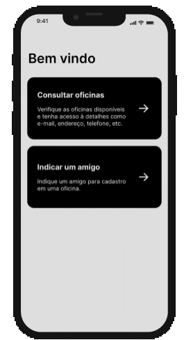
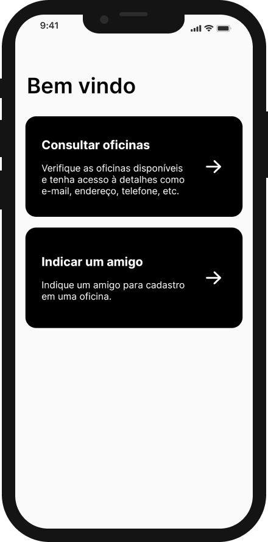
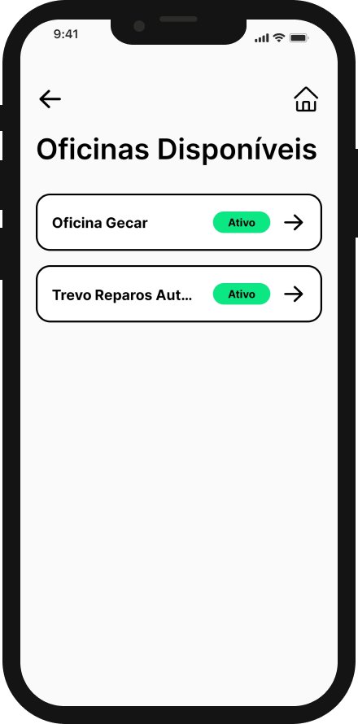

# Hinova Garage


Hinova Garage is a intuitive and minimalist app to query garages next to you.

      

## Challenge requirements:

The app must have an query garages screen:

    When you click on a garage you must be redirected to a screen with the details of the garage.

And must have another screen where you can refer a friend filling a form.

## Preview



## Screenshots





## Run the app

### Expo Go

```bash
npm install
npm start
```
